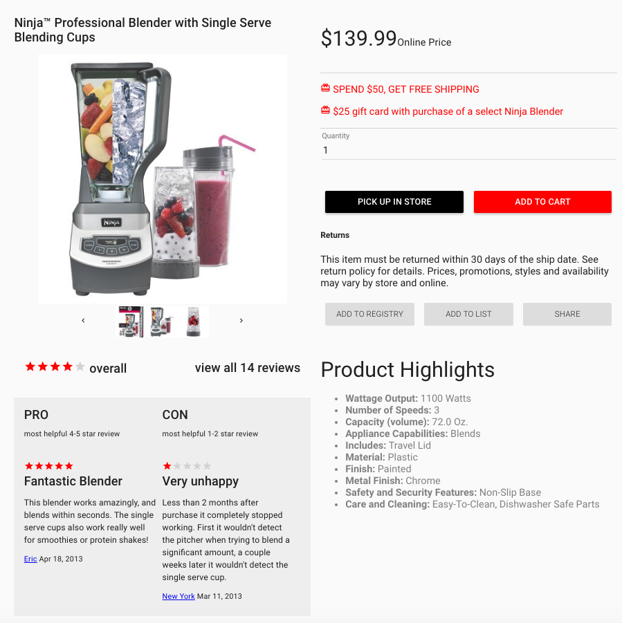
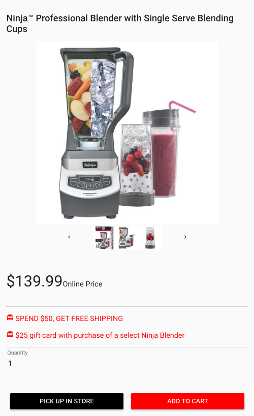

# myRetail Case Study

The task for this case study was to create a user interface populated with item data from a .json file.

### Preview

Desktop Site:

Mobile Site:

The resulting project can be viewed live [here](https://nicolaslwilson.github.io/myRetailCaseStudy/dist/).

